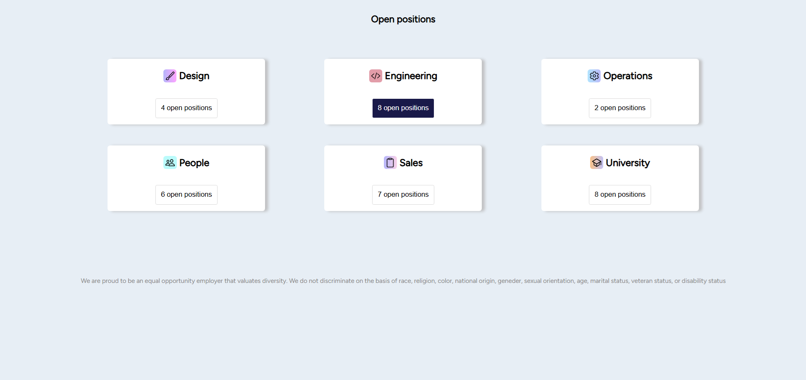

# Animación de Tarjetas

Este proyecto implementa una interactividad sencilla con tarjetas utilizando JavaScript. Al hacer clic en un título, la tarjeta asociada realiza una animación de rotación.

## Descripción del Código

El código está diseñado para manejar eventos de clic en elementos con un título (`<h3>`) y sus respectivas tarjetas (`.card`). Cuando se hace clic en un título, la tarjeta correspondiente gira en dos etapas.

### Estructura del Código

1. **Selección de Elementos**:
   - Se seleccionan todas las tarjetas y títulos del documento utilizando `querySelectorAll`.

2. **Evento de Clic**:
   - Se agrega un listener de clic al documento que verifica si el clic se realizó en un título.
   - Si es así, se busca la tarjeta correspondiente.

3. **Animación de Rotación**:
   - La tarjeta seleccionada rota 180 grados (0.5 turn) inmediatamente.
   - Después de 2 segundos, la tarjeta completa la rotación hasta 360 grados (1 turn).

### Página


### Ejemplo de HTML

```html
<div class="card">
    <div class="row">
        
        <h3>Design</h3>
    </div>
    <button class="button">4 open positions</button>
</div>
<div class="card">
    <div class="row">
        
        <h3>Engineering</h3>
    </div>
    <button class="button selected">8 open positions</button>
</div>```

